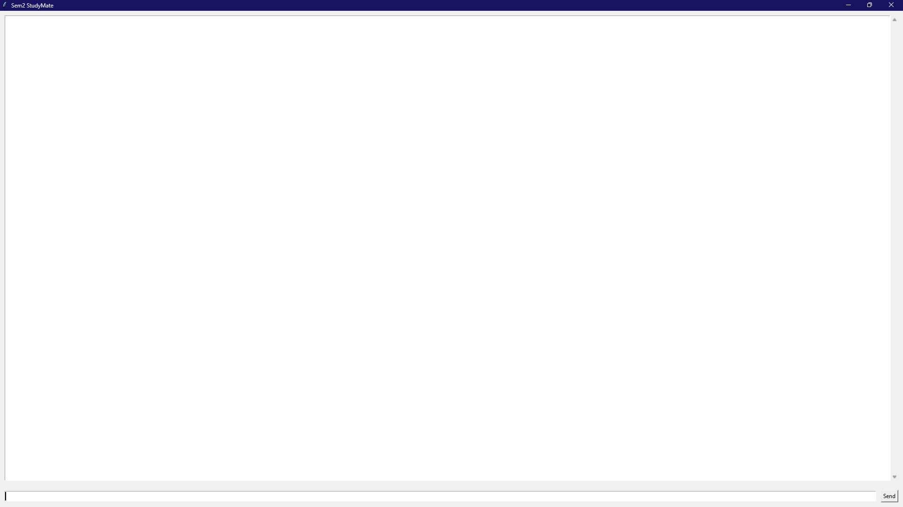

# 🤖 Sem2 StudyMate — Offline Personal Study Chatbot  
### A Tkinter-based GUI chatbot powered by Sentence Transformers  
🔥 Fully offline · Works without internet · Perfect for exam prep

This project is a lightweight GUI chatbot designed to help students revise Semester 2 subjects through natural conversation.  
It is built using:

- Python  
- SentenceTransformer (MiniLM)  
- Tkinter GUI  
- Cosine similarity-based response system  

The chatbot gives personalized study tips for:

- Engineering Mathematics  
- AI/ML basics  
- Internet & Web Programming  
- Environmental Science  
- Agriculture fundamentals  
- Electronics Systems  
- …and general exam stress & productivity issues.

---

# 📌 Features

✔ **Offline sentence-similarity chatbot**  
Uses paraphrase-MiniLM-L6-v2 for natural question matching.

✔ **Clean Tkinter GUI**  
Chat window + input box + send button.

✔ **80+ handcrafted study-related Q/A pairs**  
All mapped using embeddings for semantic search.

✔ **No internet required**  
Model is stored locally inside `model/` (≈85 MB).

✔ **Simple & fast**  
Ideal for personal use and desktop deployment.

---

# 🔽 Download Model (Required Before Running)

The model folder is **NOT included** in this GitHub repository because it is too large  
(86 MB > GitHub’s 25 MB file limit for uploads).

Please download the model manually from Google Drive:

📌 **Download Link:** https://drive.google.com/drive/folders/1gS8gm4Iyr2EyljYDC0uJTCUkzVyj9gNH?usp=drive_link

After downloading, extract and place the folder like this:

```
sem2-studymate-chatbot/
│── sem2_chatbot_gui.py
│── model/
│── requirements.txt
│── README.md
```

Then run:

```bash
python sem2_chatbot_gui.py
```

---

# 🖼 Screenshots

### 🟦 Chatbot GUI  
(Upload your screenshot here)



### 🟪 Example Conversation  


---

# 🗂 Project Structure

```
sem2-studymate-chatbot/
│── sem2_chatbot_gui.py
│── requirements.txt
│── media/
│    ├── gui_interface.png
│    └── chat_example.png
│
│── README.md
```

---

# ⚙️ Installation & Setup

### Clone the repository
```bash
git clone https://github.com/yourusername/sem2-studymate-chatbot.git
cd sem2-studymate-chatbot
```

### Install required libraries
```bash
pip install -r requirements.txt
```

### Run the chatbot
```bash
python sem2_chatbot_gui.py
```

---

# 📦 Requirements

```
sentence-transformers
scikit-learn
numpy
torch
```

*(Add torch manually if not auto-installed.)*

---

# 🧠 How It Works

### Step — Load MiniLM Sentence Transformer  
Creates embeddings for all predefined questions.

### Step — User query → encode → cosine similarity  
Finds closest Q/A pair based on meaning.

### Step — GUI displays the best response  
If similarity is low (< 0.5), a fallback response is shown.

---

# 🚀 Future Improvements

- Add more semester-specific Q/A knowledge  
- Add subject modules (Maths, Web Dev, Electronics, AI/ML)  
- Convert to a fully local LLM using GPT4All / llama.cpp  
- Add voice input/output  
- Replace Tkinter with PyQt5 or CustomTkinter for modern UI  

---

# 📬 Contact

**Arnav Saxena**  
AI/ML • Computer Vision • XR/VR • Robotics  
📧 Email: **arnav12saxena@gmail.com**  
🔗 LinkedIn: https://www.linkedin.com/in/arnav-saxena-a9a217367
